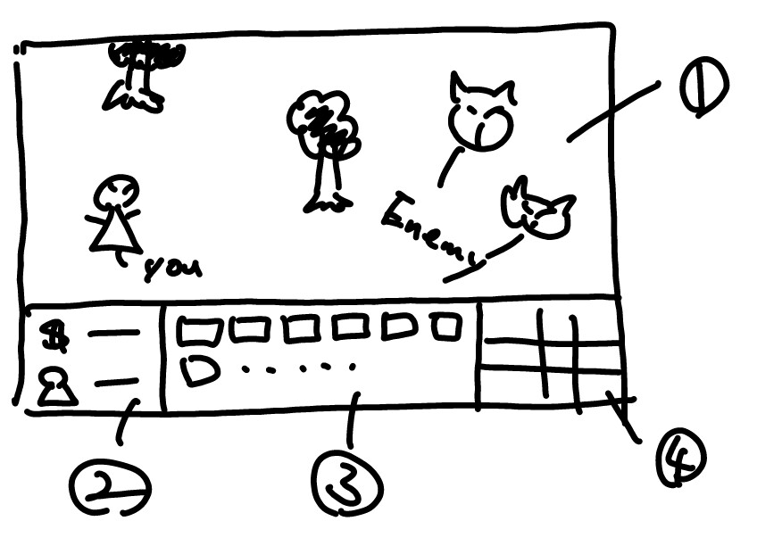

# design 

## scene transition

## game scene

### outline

### 1. field

* stocked units can place anywehere on this pane
* enemies spawn on right edge of screen, and toword "you"
* "you" must be placed to start game. in other word, game starts at placing "you".
* ally units (that are summoned by player) will fight automatically.
* if ally units are tapped, they will back to 3. stocked units
  * ready to re-summon

### 2. resources

* money and number of units ( placed / generated )
* money is used to generate units
* increase when enemies are killed

### 3. stocked units

* units can be generated at "unit generation panel"
* generated units will be listed here
* tap on a generated unit, change mode into "summon mode"
  * then tap on 1. field, units will be placed there (summon)
* unit that is in generating will also be listed here
  * if tap them, it means canceling of generating
  * money will be back if unit generation is canceled

### 4. unit generation panel

* list of units they can start to generate
* unit generation takes short time.
* when unit generation completed, it will be listed on 3. stocked units
